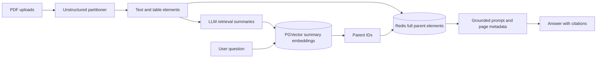

# CiteCraft RAG

[](https://www.python.org/)
[](https://streamlit.io/)

**A source-grounded research assistant for asking questions across multiple PDFs—with every answer tied back to a filename and page.**

CiteCraft extracts narrative text and tables, creates compact retrieval summaries, stores their
embeddings in PostgreSQL with pgvector, keeps the complete source elements in Redis, and uses the
retrieved evidence to generate cited answers in a Streamlit chat interface.

## UI preview

### Document-grounded answers with citations


### Detailed answers from retrieved PDF content


## Highlights

- Extracts text, tables, and page metadata from multiple PDFs with Unstructured
- Searches compact summaries while returning the full parent evidence to the answer model
- Deduplicates uploads by SHA-256 content hash across sessions
- Filters retrieval to the documents active in the current workspace
- Produces numbered filename and page citations, including an explicit no-answer path
- Stores vectors in PostgreSQL/pgvector and parent content in Redis
- Includes unit tests, linting, Docker Compose infrastructure, and GitHub Actions CI

## Architecture



Searching summaries improves matching for long or structured elements. Returning the complete
parent elements preserves the detail needed for accurate answers and citations.

## Quick start

### Prerequisites

- Python 3.10–3.12
- Docker with Docker Compose
- An OpenAI API key

The default `hi_res` parser downloads document-layout models on its first run and can require
several minutes and significant memory.

### Install and run

```bash
git clone <your-repository-url>
cd citecraft-rag

python -m venv .venv
source .venv/bin/activate        # Windows: .venv\Scripts\activate
python -m pip install --upgrade pip
python -m pip install -r requirements.txt

cp .env.example .env
# Set OPENAI_API_KEY in .env

docker compose up -d
streamlit run app.py
```

Open [http://localhost:8501](http://localhost:8501), upload one or more PDFs, select **Index
documents**, and ask a question. If `OPENAI_API_KEY` is not set in `.env`, the sidebar accepts a
key for the current session.

You can also use the included shortcuts:

```bash
make install
make infra-up
make run
```

## Configuration

Copy `.env.example` to `.env` and adjust these values as needed:

| Variable | Default | Purpose |
| --- | --- | --- |
| `OPENAI_API_KEY` | required | Embeddings, retrieval summaries, and answers |
| `POSTGRES_URL` | local Compose URL | PostgreSQL/pgvector connection |
| `REDIS_URL` | `redis://localhost:6379/0` | Parent-element and ingestion metadata store |
| `PGVECTOR_COLLECTION` | `citecraft_documents` | Vector table and index prefix |
| `CHAT_MODEL` | `gpt-4o-mini` | Retrieval-summary and answer model |
| `EMBEDDING_MODEL` | `text-embedding-3-small` | Vector embedding model |
| `EMBEDDING_DIMENSIONS` | `1536` | Dimension of the selected embedding model |
| `TOP_K` | `5` | Parent elements retrieved per question |
| `PARTITION_STRATEGY` | `hi_res` | `auto`, `fast`, `hi_res`, or `ocr_only` |
| `MAX_CONTEXT_CHARACTERS` | `24000` | Context-size guardrail for answer generation |
| `SUMMARY_CONCURRENCY` | `4` | Maximum concurrent summary requests |

For faster extraction of digitally generated PDFs, use `PARTITION_STRATEGY=fast`. For image-only
scans, try `PARTITION_STRATEGY=ocr_only`.

## Project layout

```text
.
├── .github/                     # CI and contribution templates
├── app.py                       # Streamlit interface
├── compose.yaml                 # PostgreSQL/pgvector and Redis services
├── src/citecraft/
│   ├── config.py                # Environment-backed settings
│   ├── pdf_processor.py         # PDF text/table extraction
│   ├── summarizer.py            # Retrieval-summary generation
│   ├── storage.py               # PGVector child index and Redis parents
│   ├── prompts.py               # Grounding prompts and context formatting
│   └── service.py               # Ingestion and answer orchestration
└── tests/                       # Fast unit tests
```

## Quality checks

```bash
python -m pip install -e ".[dev]"
pytest
ruff check .
```

GitHub Actions runs the same test and lint checks for pull requests and pushes to `main`.

## Data and privacy

- Extracted content and embeddings are stored in the locally configured Redis and PostgreSQL
  services.
- Relevant excerpts are sent to OpenAI for retrieval summaries and answer generation.
- API keys belong in `.env` or `.streamlit/secrets.toml`; both are excluded from version control.
- Uploaded files are written only to a temporary directory during ingestion.
