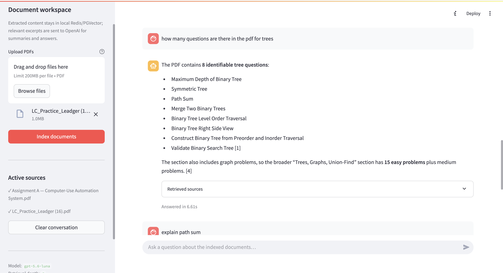
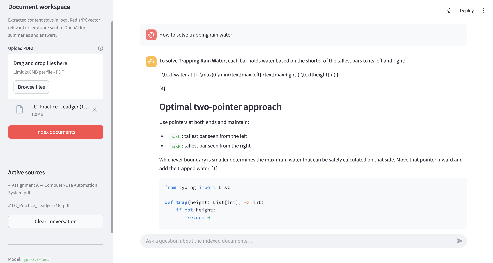
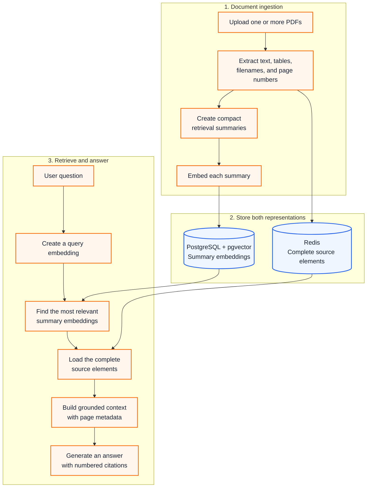

# CiteCraft RAG

[](https://www.python.org/)
[](https://streamlit.io/)

**A source-grounded research assistant for asking questions across multiple PDFs—with every answer tied back to a filename and page.**

CiteCraft extracts narrative text and tables, creates compact retrieval summaries, stores their
embeddings in PostgreSQL with pgvector, keeps the complete source elements in Redis, and uses the
retrieved evidence to generate cited answers in a Streamlit chat interface.

## UI preview

### Document-grounded answers with citations



### Detailed answers from retrieved PDF content



## Highlights

- Extracts text, tables, and page metadata from multiple PDFs with Unstructured
- Searches compact summaries while returning the full parent evidence to the answer model
- Deduplicates uploads by SHA-256 content hash across sessions
- Filters retrieval to the documents active in the current workspace
- Produces numbered filename and page citations, including an explicit no-answer path
- Stores vectors in PostgreSQL/pgvector and parent content in Redis
- Includes unit tests, linting, Docker Compose infrastructure, and GitHub Actions CI

## Architecture



### How the pipeline works

1. **Upload and deduplicate documents**  
   Each uploaded PDF receives a SHA-256 content hash. CiteCraft checks that hash before ingestion
   and reuses an existing index when the same document has already been processed.

2. **Extract citation-ready content**  
   Unstructured partitions each PDF into narrative text and table elements. CiteCraft preserves
   the filename, page number, element type, document hash, and a stable parent ID for every usable
   element.

3. **Create the retrieval representation**  
   Longer elements receive compact LLM-generated summaries that retain searchable names, dates,
   numbers, and technical terms. Short elements are indexed directly, while a summary failure
   falls back to the original element text.

4. **Store summaries and complete sources separately**  
   Summary embeddings are stored in PostgreSQL with pgvector for semantic similarity search. The
   complete source elements are stored in Redis under their parent IDs so retrieval never loses
   the original detail.

5. **Retrieve only from active documents**  
   A question is embedded and matched against the configured number of nearest summaries. The
   PostgreSQL query filters results by the document hashes currently active in the Streamlit
   session, then returns the matching parent IDs.

6. **Build grounded context**  
   CiteCraft loads the complete parent elements from Redis, orders them by retrieval rank, and
   formats them with numbered source labels, filenames, page numbers, and element types. A
   character limit keeps the assembled context within the configured budget.

7. **Generate and display the cited answer**  
   The answer model receives the grounded context, the question, and recent chat history. The
   interface displays the answer, retrieved source labels, page-level citations, and response
   time. If no relevant evidence is found, CiteCraft returns an explicit no-answer response.

### Embeddings and multi-vector retrieval

CiteCraft uses a parent/summary multi-vector retrieval pattern:

- Every extracted text or table element is a **parent element**. Its complete content is stored in
  Redis so the answer model receives the original evidence rather than a shortened representation.
- CiteCraft creates a compact retrieval summary for each parent and converts that summary into an
  embedding using the configured OpenAI embedding model.
- A PDF therefore produces many searchable summary vectors—one for each extracted parent element.
  Each vector is stored in pgvector with its parent ID, document hash, filename, page, and element
  type.
- The user's question is embedded with the same model. PostgreSQL uses cosine distance and its
  HNSW vector index to rank the closest summary embeddings while filtering to active documents.
- The matching vectors return parent IDs. CiteCraft uses those IDs to load the complete elements
  from Redis and construct the cited context used for answer generation.

This separation gives semantic search a concise representation while preserving full source
detail for grounded answers and page-level citations.

## Measured results

CiteCraft was evaluated on a pinned subset of the FinanceBench open-source sample: **32
human-annotated questions across 10 financial reports, 403 PDF pages, and 1,154 extracted text
and table elements**.

| Metric | Result |
| --- | ---: |
| Source-grounded responses | **85.9%** |
| Citation completeness | **84.4%** |
| Citation correctness | **79.7%** |
| Source-withheld abstention accuracy | **90.0%** |
| Retrieval latency P95 | **0.46s** |
| End-to-end latency P95 | **7.09s** |

These figures are model-graded observations from the recorded 32-question evaluation and describe
grounding, citation quality, abstention behavior, and latency for that benchmark configuration.

## Quick start

### Prerequisites

- Python 3.10–3.12
- Docker with Docker Compose
- An OpenAI API key

The default `hi_res` parser downloads document-layout models on its first run and can require
several minutes and significant memory.

### Install and run

```bash
git clone <your-repository-url>
cd citecraft-rag

python -m venv .venv
source .venv/bin/activate        # Windows: .venv\Scripts\activate
python -m pip install --upgrade pip
python -m pip install -r requirements.txt

cp .env.example .env
# Set OPENAI_API_KEY in .env

docker compose up -d
streamlit run app.py
```

Open [http://localhost:8501](http://localhost:8501), upload one or more PDFs, select **Index
documents**, and ask a question. If `OPENAI_API_KEY` is not set in `.env`, the sidebar accepts a
key for the current session.

You can also use the included shortcuts:

```bash
make install
make infra-up
make run
```

## Configuration

Copy `.env.example` to `.env` and adjust these values as needed:

| Variable | Default | Purpose |
| --- | --- | --- |
| `OPENAI_API_KEY` | required | Embeddings, retrieval summaries, and answers |
| `POSTGRES_URL` | local Compose URL | PostgreSQL/pgvector connection |
| `REDIS_URL` | `redis://localhost:6379/0` | Parent-element and ingestion metadata store |
| `PGVECTOR_COLLECTION` | `citecraft_documents` | Vector table and index prefix |
| `CHAT_MODEL` | `gpt-4o-mini` | Retrieval-summary and answer model |
| `OPENAI_STORE_RESPONSES` | `true` | Store summary and answer outputs in OpenAI for dashboard/API observability |
| `EMBEDDING_MODEL` | `text-embedding-3-small` | Vector embedding model |
| `EMBEDDING_DIMENSIONS` | `1536` | Dimension of the selected embedding model |
| `TOP_K` | `5` | Parent elements retrieved per question |
| `PARTITION_STRATEGY` | `hi_res` | `auto`, `fast`, `hi_res`, or `ocr_only` |
| `MAX_CONTEXT_CHARACTERS` | `24000` | Context-size guardrail for answer generation |
| `SUMMARY_CONCURRENCY` | `4` | Maximum concurrent summary requests |

For faster extraction of digitally generated PDFs, use `PARTITION_STRATEGY=fast`. For image-only
scans, try `PARTITION_STRATEGY=ocr_only`.

## Project layout

```text
.
├── .github/                     # CI and contribution templates
├── app.py                       # Streamlit interface
├── compose.yaml                 # PostgreSQL/pgvector and Redis services
├── benchmarks/                  # Reproducible FinanceBench runner and manifest
├── src/citecraft/
│   ├── config.py                # Environment-backed settings
│   ├── pdf_processor.py         # PDF text/table extraction
│   ├── summarizer.py            # Retrieval-summary generation
│   ├── storage.py               # PGVector child index and Redis parents
│   ├── prompts.py               # Grounding prompts and context formatting
│   └── service.py               # Ingestion and answer orchestration
└── tests/                       # Fast unit tests
```

## Quality checks

```bash
python -m pip install -e ".[dev]"
pytest
ruff check .
```

GitHub Actions runs the same test and lint checks for pull requests and pushes to `main`.

## Data and privacy

- Extracted content and embeddings are stored in the locally configured Redis and PostgreSQL
  services.
- Relevant excerpts are sent to OpenAI for retrieval summaries and answer generation.
- Summary and answer model responses are stored by OpenAI by default for observability. Set
  `OPENAI_STORE_RESPONSES=false` to disable application-state storage for these requests.
- API keys belong in `.env` or `.streamlit/secrets.toml`; both are excluded from version control.
- Uploaded files are written only to a temporary directory during ingestion.
